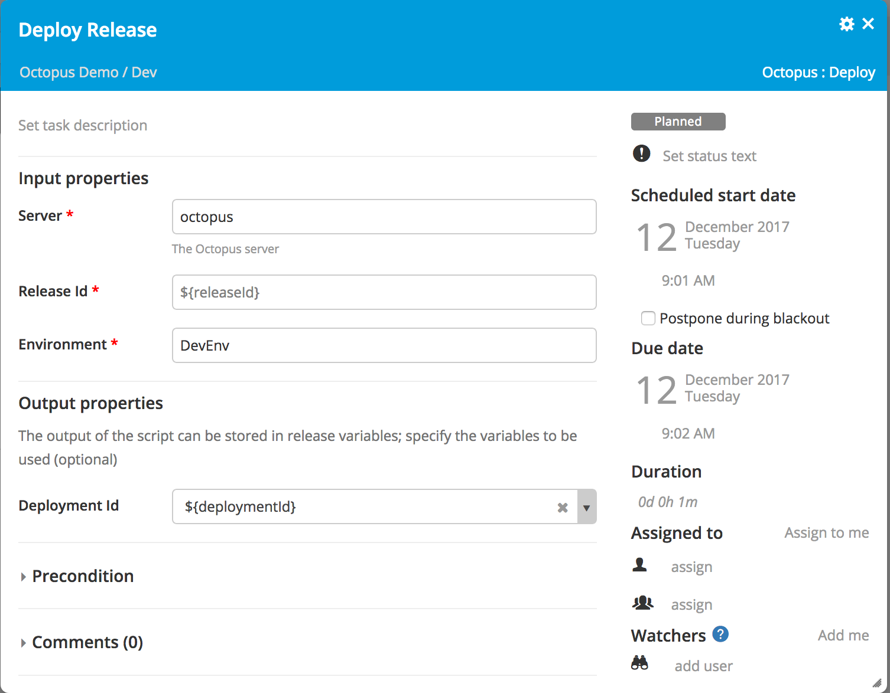

# Octopus Deploy plugin


[![Build Status][xlr-octopus-deploy-plugin-travis-image]][xlr-octopus-deploy-plugin-travis-url]
[![Maintainability][xlr-octopus-deploy-plugin-Maintainability-url]][xlr-octopus-deploy-plugin-Maintainability-image]
[![Codacy Badge][xlr-octopus-deploy-plugin-Codacy-url]][xlr-octopus-deploy-plugin-Codacy-image]
[![License: MIT][xlr-octopus-deploy-plugin-license-image]][xlr-octopus-deploy-plugin-license-url]
![Github All Releases][xlr-octopus-deploy-plugin-downloads-image]

[xlr-octopus-deploy-plugin-travis-image]: https://travis-ci.org/xebialabs-community/xlr-octopus-deploy-plugin.svg?branch=master
[xlr-octopus-deploy-plugin-travis-url]: https://travis-ci.org/xebialabs-community/xlr-octopus-deploy-plugin
[xlr-octopus-deploy-plugin-license-image]: https://img.shields.io/badge/License-MIT-yellow.svg
[xlr-octopus-deploy-plugin-license-url]: https://opensource.org/licenses/MIT
[xlr-octopus-deploy-plugin-downloads-image]: https://img.shields.io/github/downloads/xebialabs-community/xlr-octopus-deploy-plugin/total.svg
[xlr-octopus-deploy-plugin-Maintainability-url]: https://api.codeclimate.com/v1/badges/ca5d70a7bbb5d238bfdf/maintainability
[xlr-octopus-deploy-plugin-Maintainability-image]: https://codeclimate.com/github/xebialabs-community/xlr-octopus-deploy-plugin/maintainability
[xlr-octopus-deploy-plugin-Codacy-url]: https://api.codacy.com/project/badge/Grade/ff2717a153b64ca096313015ca7207f7
[xlr-octopus-deploy-plugin-Codacy-image]: https://www.codacy.com/app/Rick-BrokerOrganization/xlr-octopus-deploy-plugin?utm_source=github.com&amp;utm_medium=referral&amp;utm_content=xebialabs-community/xlr-octopus-deploy-plugin&amp;utm_campaign=Badge_Grade

## Preface

This document describes the functionality provided by the XL Release Octopus plugin.

See the [XL Release reference manual](https://docs.xebialabs.com/xl-release) for background information on XL Release and release orchestration concepts.  

## Overview

This XL Release plugin can trigger deployments on Octopus Deploy.

## Requirements

* XL Release 6.0+

## Installation

* Copy the latest JAR file from the [releases page](https://github.com/xebialabs-community/xlr-octopus-deploy-plugin/releases) into the `XL_RELEASE_SERVER/plugins` directory.
* Restart the XL Release server.

## Usage

### Create Releases

Creates a new Octopus Release and returns it's ```releaseId```


### Deploy

Deploy a ```releaseId``` to an ```environment```

